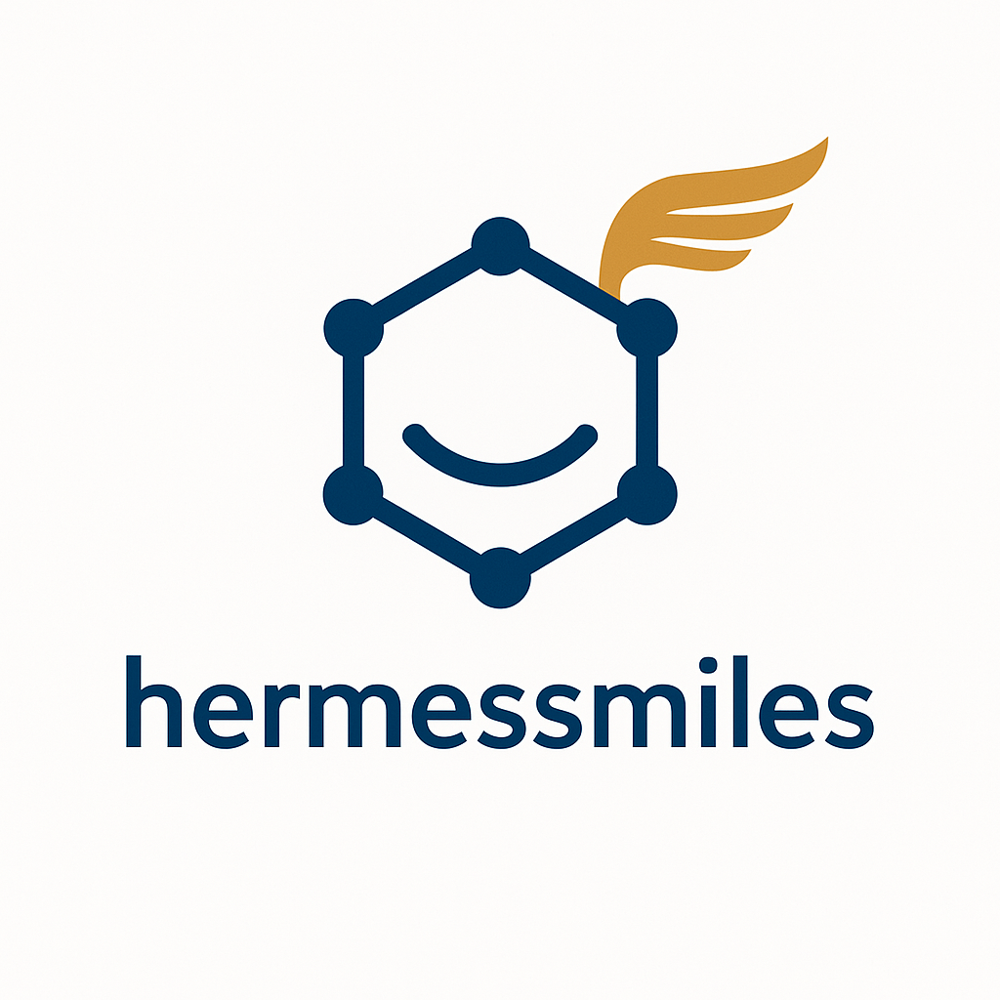

<p align="center">
  
</p>

<h3 align="center">
hermessmiles: A tool to compare two CSV files of SMILES strings, find overlapping compounds by InChIKey prefix, and generate an HTML visualization of matching structures.

</h3>


<br/>

[](https://pypi.org/project/hermessmiles/)
[](https://pypi.org/project/hermessmiles)
[](https://github.com/srijitseal/hermessmiles/actions/workflows/ci.yml)
[](https://pypi.org/project/hermessmiles/)


---

## 📌 Installation

```bash
pip install hermessmiles
```

---

## Usage
```bash
from hermessmiles.processor import SMILESProcessor, find_overlaps
from hermessmiles.visualizer import Visualizer
proc = SMILESProcessor()
df1 = proc.process("assets/df1.csv")
df2 = proc.process("assets/df2.csv")
overlaps = find_overlaps(df1, df2)
viz = Visualizer(overlaps, "output/results.html")
viz.render()
```

By default, the output HTML is saved as `overlap_structures_<timestamp>.html` in your working directory.
